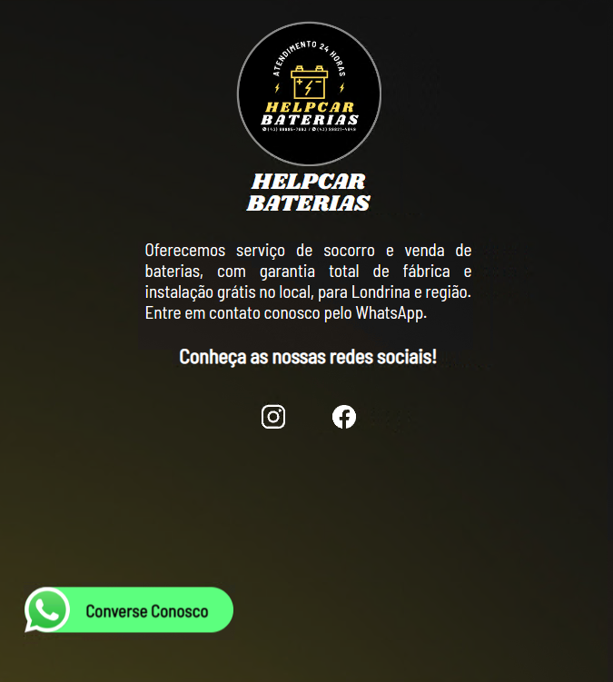

<h1 align="center"> ⚡ HelpCar Baterias ⚡ </h1>

Projeto de um Site para a empresa de socorro de baterias do meu pai. Com um pouco do serviço prestado, links para as redes sociais e também um botão animado para abrir uma conversa no Whatsapp, no contato deles. 

  <a href="#-tecnologias">Tecnologias</a>&nbsp;&nbsp;&nbsp;|&nbsp;&nbsp;&nbsp;
  <a href="#-layout">Layout</a>&nbsp;&nbsp;&nbsp;
  

  

 

## 🚀 Tecnologias

Esse projeto foi desenvolvido com as seguintes tecnologias:

- HTML e CSS
- JavaScript
- Git e Github
- Figma

## :scroll: Layout

Layout foi pensado para ser o mais intuítivo possível e funcionar mesmo como uma página de "contato", para o cliente conhecer as redes sociais e mandar uma mensagem pelo whatsapp

Feito com ♥ by Luan Araujo :wave:
